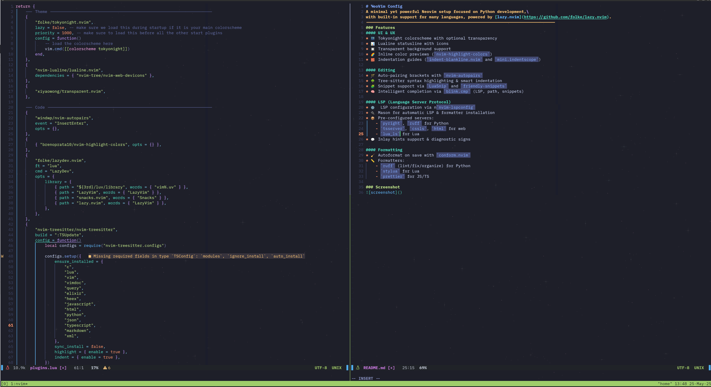

# Neovim Config 

A minimal yet powerful Neovim setup focused on Python development,\
with built-in support for many languages, powered by [lazy.nvim](https://github.com/folke/lazy.nvim)\
as a plugin manager.

------------------------------------------------------------------------------
### Features
#### UI & UX
* 🌃 Tokyonight colorscheme with optional transparency
* 📊 Lualine statusline with icons
* 🔲 Transparent background support
* 🌈 Inline color previews (`nvim-highlight-colors`)
* 🧱 Indentation guides (`indent-blankline.nvim` and `mini.indentscope`)

#### Editing
* 🪄 Auto-pairing brackets with `nvim-autopairs`
* 🌳 Tree-sitter syntax highlighting & smart indentation
* 🧩 Snippet support via `LuaSnip` and `friendly-snippets`
* 🧠 Intelligent completion via `blink.cmp` (LSP, path, snippets)

#### LSP (Language Server Protocol)
* ⚙️ LSP configuration via n`nvim-lspconfig`
* 🔌 Mason for automatic LSP & formatter installation
* 📦 Pre-configured servers:
    - `pyright`, `ruff` for Python
    - `tsserver`, `cssls`, `html` for web
    - `lua_ls` for Lua
* 💬 Inlay hints support & diagnostic signs

#### Formatting
* 🧹 Autoformat on save with `conform.nvim`
* 📏 Formatters:
    - `ruff` (lint/fix/organize) for Python
    - `stylua` for Lua
    - `prettier` for JS/TS

------------------------------------------------------------------------------
### Screenshot

